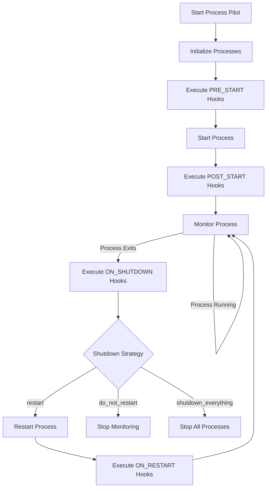

# Process Pilot

Process Pilot is a Python-based tool for managing and monitoring processes defined in a manifest file. It supports JSON and YAML formats for defining processes and their configurations.

## Features

- Load process configurations from JSON or YAML files.
- Manage process lifecycles with customizable hooks.
- Monitor process resource usage.
- Define shutdown strategies for processes.

## Installation

To install the dependencies, use [Poetry](https://python-poetry.org/):

```sh
poetry install
```

## Usage

To start the Process Pilot, run:

```sh
poetry run python -m process_pilot.process
```

## Configuration

### Process Manifest

The process manifest defines the processes to be managed. It can be written in JSON or YAML format.

#### Example JSON Manifest

```json
{
  "processes": [
    {
      "name": "example",
      "path": "sleep",
      "args": ["5"],
      "timeout": 3,
      "shutdown_strategy": "do_not_restart"
    }
  ]
}
```

#### Example YAML Manifest

```yaml
processes:
    - name: example
        path: sleep
        args: ["5"]
        timeout: 1.0
        shutdown_strategy: do_not_restart
```

## Process Lifecycle

The following Mermaid diagram illustrates the process lifecycle and when various hook functions are called:



## Development

### Running Tests

To run the tests, use:

```sh
poetry run pytest
```

### Linting and Formatting

To lint and format the code, use:

```sh
poetry run ruff check .
poetry run autopep8 --in-place --recursive .
```

## License

This project is licensed under the MIT License. See the [LICENSE](LICENSE) file for details.

## Contributing

Contributions are welcome! Please open an issue or submit a pull request.

## Contact

For any inquiries, please contact James Armes at jamesleearmes@gmail.com.
